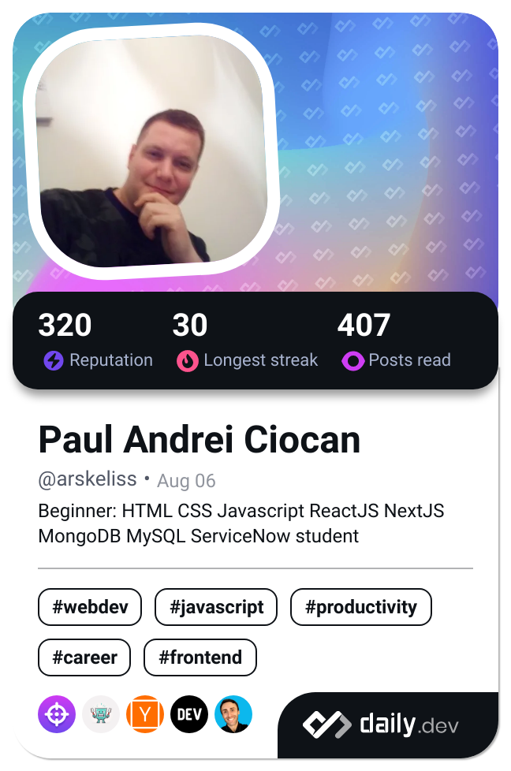

### Hi there 👋

- 🔭 I’m currently working on `Hungarian Wesnoth Community Fan Portal`, a battleship clone game called `Oceans5` and my very own play-by-post FRPG called `Envoys Reborn`
- 🌱 I’m currently learning `ReactJS`, `NextJS` and `ServiceNow CSA Exam` preparation
- 👯 I’m looking to collaborate on Open-Source Javascript projects
- 🤔 I’m looking for help with becoming either Frontend or Backend dev
- 📫 How to reach me: csokan.palandras@gmail.com or ciocanpa87@gmail.com
- ⚡ Fun facts:
1. English is not my mother tongue.
2. I like to develop a template-like project and copy the functionality to the rest of my projects.
3. Still learning when, what and how to commit.

<!--  -->

  
<h2>  Stats</h2>

  

     
     
     
    
  

<!--
**andrejmoltok/andrejmoltok** is a ✨ _special_ ✨ repository because its `README.md` (this file) appears on your GitHub profile.

Here are some ideas to get you started:
- 🔭 I’m currently working on ...
- 🌱 I’m currently learning ...
- 👯 I’m looking to collaborate on ...
- 🤔 I’m looking for help with ...
- 💬 Ask me about ...
- 📫 How to reach me: ...
- 😄 Pronouns: ...
- ⚡ Fun fact: ...

-->
